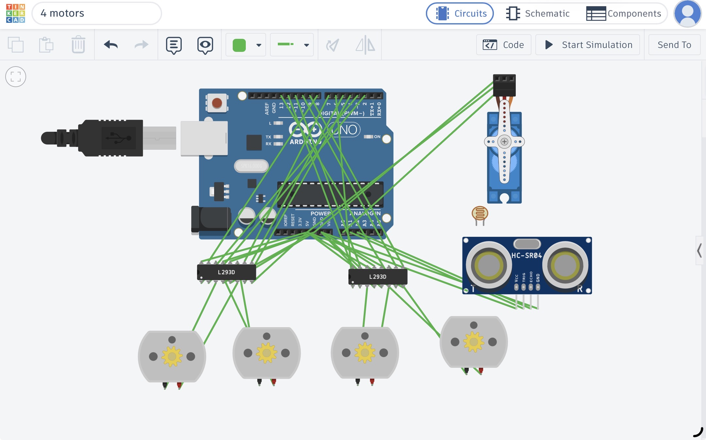

# four-motors-obstacle-avoidance

## Project Description

This project controls four DC motors using two L293D motor drivers, an Arduino Uno, a Micro Servo, and an Ultrasonic Distance Sensor.

The system moves forward while the path is clear. When the ultrasonic sensor detects an obstacle at a distance of 10 cm or less, the four motors stop and the servo motor rotates to scan the area.

## Components

- Arduino Uno
- 2 × L293D Motor Driver
- 4 × DC Motors
- Micro Servo
- Ultrasonic Distance Sensor
- Breadboard
- Jumper Wires

## How It Works

When the measured distance is greater than 10 cm, the four motors move forward.

When the distance is 10 cm or less:

- The four motors stop.
- The servo rotates from 0° to 180°.
- The servo returns to 90°.
- The motors remain stopped while the obstacle condition is active.

## Tinkercad Simulation

[Open Tinkercad Project]https://www.tinkercad.com/things/1UR5p9N5xiN/editel?returnTo=%2Fdashboard&sharecode=jQsQq5BQRNhpKqX1q34ZZTM5_ueCKa0m9vTM-pPwXoQ

## Project Files

[obstacle_avoidance.txt](./obstacle_avoidance.txt)

[circuit.jpeg](./circuit.jpeg)

[simulation.mov](./simulation.mov)

## Circuit

